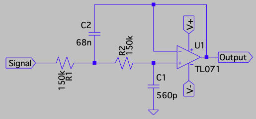
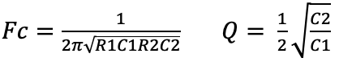
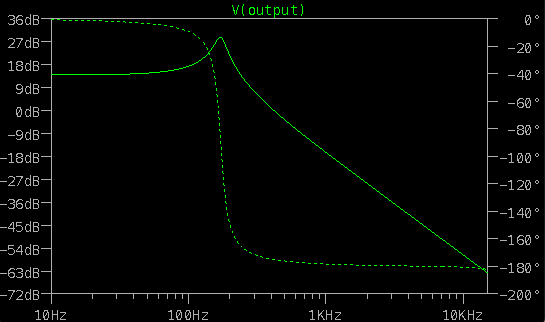
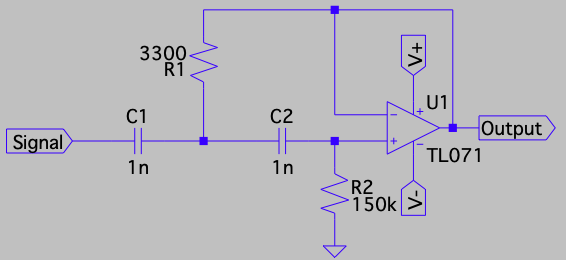
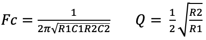
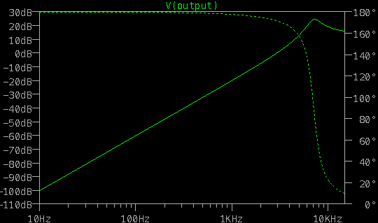
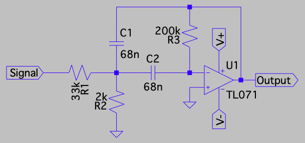
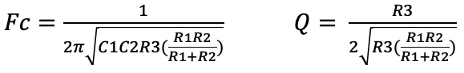
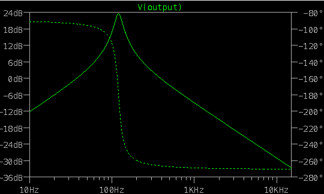

# Vocoder

## Goal

Goal of the project:
- A 16 band vocoder (1 low pass, 1 high pass and 14 band pass filters)
- 16 10-part LED VU indicator (using 16 LM3916s and 160 red 2 mm LEDs)
- 16 slider pots to set the volume for the particular band
- patch box (eurorack style) to patch different kinds of frequency band assignments
- sawtooth & noise oscillator
- 1 V/o with a AS3340 or CEM3340 chip?
- Creating kinda a super saw using a phase-shift
- XLR microphone and line level input possibility for the program

## Sources

- https://www.instructables.com/Build-an-analog-vocoder: a good start for the vocoder, but doesn't have a low pass and high pass band
- https://www.academia.edu/3483120/Implementation_and_Analysis_of_an_Eight_Band_Analog_Vocoder?auto=download: resembles to first one, but with extra VU LEDs
- http://sim.okawa-denshi.jp/en/OPtazyuBakeisan.htm: to make the calculations for the R and C levels, but also has circuits for the low and high pass filters
- https://www.factmag.com/2019/04/29/moog-spectravox-vocoder-spectral-modulator-moogfest-exclusive: inspiration look, feel & sound
- https://schneidersladen.de/de/grp-synthesizer-vocoder-v22: inspiration, functionality (looks very good, but ah, expensive!)
- http://musicfromouterspace.com/analogsynth_new/WALLWARTSUPPLY/WALLWARTSUPPLY.php: good power supply specification
- https://sound-au.com/project63.htm: nice information about calculation values for band pass filter
- http://musicfromouterspace.com/analogsynth_new/VOCODER2013/VOCODER2013.php: MFOS vocoder
- https://www.haraldswerk.de/Vocoder/Analyzer/Voc_Analyzer.html#Anker03: NGF Vocoder project
- http://www.yusynth.net/Modular/EN/BANK/index.html: goede beschrijving hoe de dubbele band pass filter werkt. Bovendien ook betere high- and low pass filters (ook dubbel uitgevoerd)
- http://www.yusynth.net/Modular/EN/SAWANIM/index.html: description of a saw animator that can be used in conjunction with the one VCO to create the supersaw effect
- https://www.muffwiggler.com/forum/viewtopic.php?t=136217: some discussion about the Okita vocoder
- http://privat.bahnhof.se/wb552721/pdf/okita.pdf: description of the Okita vocoder
- https://en.wikipedia.org/wiki/Range_(music): a nice page about the range of human voice and musical instruments
- https://www.translatorscafe.com/unit-converter/en-US/calculator/note-frequency/: calculates the note vs frequency
- https://www.ti.com/lit/an/sloa049b/sloa049b.pdf: elaborate explanation of active low-pass filter design

## BOM

- LM3916 LED driver
- TL074 op amps
- Condensators
- Resistors
- LM7812 and LM7912 for power supply

## Frequency bands

Different vocoders use different bands (see [this spreadsheet](bands.xlsx) for some numbers). Bands are stated in frequency, but it would be more logical to arrange bands in notes, as vocoders will devide the frequency domains in a exponentials scale. The GRP, for example devides the range F#3 to A8 into equal notes, spaced 3 semitones apart (using F#, A, C and D#). The Moog devides the range D#3 to D#8 into equal notes, spaces 4 semitones apart (using D#, G and B). Interestingly, the 2504 Hz channel is a bit off: it should be 2540 Hz (!).

So, lets have a frequency range spaced 4 semitones apart (using A, C# and F) and have 16 channels (NB: calculations are made using just intonation! - Maybe better to use equal temperment?)

| Band | Note | Frequency just | Frequency equal |
|------|------|----------------|-----------------|
| LP | F3+ | 176 | 175 |
| 1 | A3 | 220 | 220 |
| 2 | C#4- | 275 | 277 |
| 4 | F4+ | 352 | 349 |
| 3 | A4 | 440 | 440 |
| 5 | C#5- | 550 | 554 |
| 7 | F5+ | 704 | 698 |
| 6 | A5 | 880 | 880 |
| 8 | C#6- | 1100 | 1109 |
| 9 | F6+ | 1408 | 1397 |
| 10 | A6 | 1760 | 1760 |
| 11 | C#7- | 2200 | 2217 |
| 12 | F7+ | 2816 | 2794 |
| 13 | A7 | 3520 | 3520 |
| 14 | C#8- | 4400 | 4435 |
| 15 | F8+ | 5632 | 5588 |
| HP | A8 | 7040 | 7040 |

## Filter topology and calculations

The main inspiration is from the yusynth fixed filter bank, which is actually a good starting point for a vocoder! The vocoder has a bit more band pass filters, so some calculations have to be made differently. For the band pass filters, the Q is only dependent on the values of R, so the easiest way to get the same Q for all band pass filters, is to use the same resistor values and only change the values for C.

We need two band pass filters in series to get the required -24db slope, and to get a wider "band": so we have two band pass filters with frequencies that are to the left and the right of the actual required frequency band.

For the low- and high- pass filters, we also need a two step filter, to get the required -24db. The topologies below are only for one step each!

(to find out: multiple feedback low- & high-pass filters vs Sallen-Key low- & high-pass filters).

## filters

### Low pass

A Sallen-Key low-pass filter:

This topology uses a TL071 op amp, with a ±12V power supply and:
- R1: 150k
- R2: 150k
- C1: 560p
- C2: 68n

(NB: the Q-formula is only correct for R1 = R2!)

- Q: 5.51
- Fc: 171.9

Using [ltspice](https://www.analog.com/en/design-center/design-tools-and-calculators/ltspice-simulator.html), we can calculate the frequency response for this low pass filter (see [lowpass.asc](lowpass.asc) for the script):

## High pass

A Sallen-Key high-pass filter:

This topology uses a TL071 op amp, with a ±12V power supply and:
- R1: 3300
- R2: 150k
- C1: 1n
- C2: 1n

(NB: the Q-formula is only correct for C1 = C2!)

- Q: 3.37
- Fc: 7153.5

Using [ltspice](https://www.analog.com/en/design-center/design-tools-and-calculators/ltspice-simulator.html), we can calculate the frequency response for this high pass filter (see [highpass.asc](highpass.asc) for the script):

## Band pass

A multiple feedback band pass filter:

This topology uses a TL071 op amp, with a ±12V power supply and:
- R1: 33k
- R2: 2k
- R3: 200k
- C1: 68n
- C2: 68n

- Q: 5.15
- Fc: 120.5

Using [ltspice](https://www.analog.com/en/design-center/design-tools-and-calculators/ltspice-simulator.html), we can calculate the frequency response for this band pass filter (see [bandpass.asc](bandpass.asc) for the script):

